# Badre Abderrahmane Alloul
**Architecting the Digital Watershed**  
*Scalable Environmental Intelligence | Computational Hydrology | Geospatial Systems Engineering*

---

### � The Physics of Data
Engineering at the intersection of planetary physics and high-performance software. My work is not about creating drafts; it is about building **systems of record** for the e-water and energy sectors. 

With a foundation in **Hydroinformatics** and **Numerical Simulation** (ENSE3/ENSH), I translate the complex dynamics of rivers and climate into robust, production-grade architectures. My design philosophy is simple: **Precision at Scale**. If a system cannot handle multi-TB datasets with sub-second latency, it is not yet finished.

---

### 🏗️ The Digital Watershed: System Topology
*Visualizing the flow from raw observations to operational intelligence.*

```mermaid
graph LR
    subgraph "Raw Observations"
        A[(Sentinel-1/2)]
        B[(ERA5/CMIP6)]
    end
    
    subgraph "The Engine"
        C{Dask / xarray / SLURM}
        D[Bias Correction / JIT Optimization]
    end
    
    subgraph "The Ecosystem"
        E[(PostGIS / STAC / COG)]
        F[FastAPI / PyQGIS]
    end
    
    A & B --> C
    C --> D
    D --> E
    E --> F
    F --> G[Operational Insights]
    
    style C fill:#0c0c0f,stroke:#00d4aa,stroke-width:2px;
    style E fill:#0c0c0f,stroke:#00d4aa,stroke-width:2px;
```

---

### 🎯 Knowledge Pillars & Distribution
*Domain depth across the full-stack of environmental simulation.*

| Pillar | Focus Area | Knowledge Density |
| :--- | :--- | :--- |
| **Continental Hydrology** | Flood Risk, Wflow-SBM, WMS/WFS, Extreme Stats | `████████░░ 80%` |
| **Energy Infrastructure** | Hydropower, OnSSET, Cascade Opt, Renewables | `████████░░ 75%` |
| **Geospatial Engineering** | PostGIS, GeoAI, STAC/COG, Rasterio/GDAL | `███████░░░ 70%` |
| **Software Infrastructure** | Python, FastAPI, Docker/SLURM, CI/CD | `██████░░░░ 65%` |

---

### 🔬 High-Signal Deployments
- **National Flood Protection (INRAe)**: Productionized research prototypes into hardened Python packages. Cut processing cycles from days to hours on SLURM clusters.
- **4GW Hydropower Portfolio (ENGIE)**: Built operational forecasting systems integrating SCADA and ERA5. Delivered 80% compute reduction via Numba JIT and Bayesian optimizers.
- **Serverless Analytics (REOR20)**: Architected an S3-native data lake with STAC indexing for sub-second hazard queries across global datasets.
- **National Dam Database (ANBT)**: Designed high-performance PostGIS schemas for 150+ major dams; implemented GiST indexing for real-time spatial joins.

---

### �️ Tools of the Trade
- **Computation**: `Python (NumPy, SciPy, xarray, Dask)` `Numba` `SQL` `Lua`.
- **Simulation**: `TELEMAC-2D` `ANUGA` `HEC-HMS` `Wflow-SBM` `LISFLOOD-FP`.
- **Geospatial**: `PostGIS` `Rasterio` `GDAL/OGR` `PyQGIS` `TorchGeo` `ArcPy`.
- **Ops/Cloud**: `SLURM` `Docker` `AWS (S3/Lambda/EC2)` `GitHub Actions`.

---

[**Explore the Portfolio**](https://badibosspy.github.io) • [**Technical Writing**](https://linkedin.com/in/badre-abderrahmane-alloul)

> *"Scalability is the only true validation of precision."*
