# Badre Abderrahmane Alloul
**Geospatial Software Engineer & Computational Hydrologist**  
*Scaling Environmental Intelligence across Water, Energy, and Agriculture.*

---

### 🌐 Interdisciplinary Systems Science
I bridge the gap between physical engineering and scalable software architectures. My work focuses on building the **Digital Infrastructure** required to manage our planet's most critical resources. By integrating **Numerical Simulation** with **Cloud-Native Geospatial Pipelines**, I deliver precision at the scale of continents.

---

### 🏗️ The Engineering Ecosystem
*Visualizing the flow from planetary observation to operational intelligence.*

```mermaid
graph LR
    subgraph "Raw Signals"
        A[(RS: S2/L8/Sentinel)]
        B[(Meteorology: ERA5/CMIP6)]
    end
    
    subgraph "The Core Engine"
        C{Dask / xarray / SLURM}
        D[Numerical Modeling / JIT Optimization]
    end
    
    subgraph "Scalable Delivery"
        E[(PostGIS / STAC / COG / BigQuery)]
        F[FastAPI / PyQGIS / Dashboards]
    end
    
    A & B --> C
    C --> D
    D --> E
    E --> F
    F --> G[Global Environmental Insights]
    
    style C fill:#0c0c0f,stroke:#00d4aa,stroke-width:2px;
    style E fill:#0c0c0f,stroke:#00d4aa,stroke-width:2px;
```

---

### 🔧 Technological Arsenal

#### 🌍 Geospatial & Remote Sensing
 
 
 
 
 

#### 🌊 Water & Energy Simulation
- **Hydrodynamic Modeling**: `TELEMAC-2D` `ANUGA` `HEC-RAS` `LISFLOOD-FP`.
- **Hydrological Forecasting**: `HEC-HMS` `Wflow-SBM` `Rainfall-Runoff Modeling`.
- **Infrastructure Opt**: `OnSSET` `Hydropower Cascade Modeling` `Dam Safety Simulation`.

#### 🤖 Data Science & Geo-AI
 
 
 
 

####  Data Architect & Storage
 
 
 

#### 🚀 Software Engineering & DevOps
 
 
 
 

---

### 🥋 Core Pillars of Impact
- **Flood Analytics**: Transforming complex research into production-grade pipelines for national-level hazard mitigation.
- **Energy Optimization**: Architecting decision-tools for GW-scale hydropower portfolios and renewable site selection.
- **Agricultural Monitoring**: Scaling remote-sensing workflows for multi-TB vegetation and water-scarcity analysis.
- **High-Performance Data Ops**: Reducing compute cycles by orders of magnitude through JIT optimization and distributed processing.

---

### 🎯 Philosophy: Precision at Scale
Secure water resources, optimized energy grids, and resilient agriculture require more than models—they require **Robust Systems**. I build those systems to be **Reproducible, Scalable, and Observable**.

[**Deep-dive into the Portfolio →**](https://badibosspy.github.io) • [**Professional Connectivity →**](https://linkedin.com/in/badre-abderrahmane-alloul)

> *"The infrastructure of the natural world is now digital. I build the code that runs it."*
