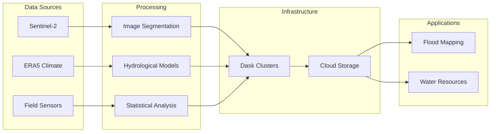

# Badre Abderrahmane Alloul
**Geospatial Software Engineer & Computational Hydrologist**  
*Lyon, France*

---

### 🌐 Engineering Ecosystem
I build software systems that combine satellite remote sensing with hydrological modeling. My work focuses on processing multi-spectral imagery and running physics-based simulations to support water resource management and flood risk assessment.

---

### 🔬 Current Learning & Development
I'm currently expanding my skills in several areas:
- **Deep Learning for Satellite Imagery**: Working with PyTorch and TorchGeo to build image segmentation models (U-Net, DeepLabv3+) for land cover classification. Training on Sentinel-2 data to detect water bodies and vegetation changes.
- **Cloud Infrastructure**: Deploying computational workflows on AWS and Google Cloud. Learning to optimize costs while processing large raster datasets (multi-TB) using cloud-optimized formats like COG and STAC catalogs.
- **Physics-Based Machine Learning**: Experimenting with ways to incorporate hydrological equations into neural networks, though this is still early-stage work for me.

---

### 🔧 Technical Skills

#### 🌍 Geospatial & Remote Sensing
 
 
 
 
 

#### 🌊 Hydrology & Environmental Modeling
- **Simulation Tools**: Wflow, TELEMAC-2D, ANUGA, HEC-RAS
- **Analysis**: Extreme value statistics (GEV distributions), intensity-duration-frequency curves, vegetation indices (NDVI, EVI)
- **Applications**: Flood modeling, hydropower assessment, agricultural water management

#### 🤖 Programming & Data Science
 
 
 
 

#### 🗄️ Databases & Cloud Platforms
 
 
 

---

### 💼 What I'm Working On
I design and implement geospatial data pipelines for environmental monitoring. This includes writing Python code to process satellite imagery, setting up PostgreSQL/PostGIS databases for spatial queries, and configuring cloud infrastructure to handle large datasets efficiently. My goal is to make remote sensing data more accessible for water resource planning and disaster preparedness.

For more examples of my work, visit my [portfolio](https://badibosspy.github.io) or connect on [LinkedIn](https://linkedin.com/in/badre-abderrahmane-alloul).
