# Badre Abderrahmane Alloul
**Geospatial Software Engineer & Computational Hydrologist**  
*Environmental Intelligence | Scientific Systems Architecture | Lyon, France*

---

### 🌍 Turning Multi-Disciplinary Data into Applied Environmental Intelligence

I create unified architectures that bridge **satellite earth observation**, **numerical simulation**, and **AI-powered analytics**. My work translates massive, heterogeneous climate and geospatial datasets into actionable intelligence for hazard mitigation, resilience, and high-impact decision-making.

#### **What sets my approach apart?**
- **Full-Stack Impact:** From scientific code refactoring and spatial DB design, to delivering scalable, cloud-ready geospatial platforms for climate risk and energy systems (INRAe, ENGIE, REOR20 AG).
- **Tech-Leading Pipelines:** Architect reliable data workflows—CDO/NCO, xarray, Dask, cloud-native ETL—integrating everything from API-driven ingestion to on-prem HPC simulation and real-world dashboarding.
- **Open Science & Collaboration:** I champion reproducibility and open standards, maintain OSS tooling, and foster knowledge transfer across R&D and industry collaborations.

---

### 🌐 Unified Environmental Observation System (UEOS)

I engineer architectures that bridge the gap between **Physical Simulation** and **Artificial Intelligence**. My workspace is a multi-layered topology where multispectral satellite signals converge with numerical PDE solvers to produce environmental foresight.

```mermaid
graph TD
    subgraph "I. DATA ASSIMILATION LAYER"
        A1[(Sentinel Multi-Spectral)]
        A2[(ERA5/CMIP6 Reanalysis)]
        A3[(In-Situ Sensor Networks)]
    end

    subgraph "II. INTELLIGENCE & INFERENCE"
        B1{Latent Space Mapping}
        B2[Computer Vision: U-Net / SAM]
        B3[Physics-Informed ML]
        B4[Numerical Fluid Dynamics]
    end

    subgraph "III. SCALABLE ORCHESTRATION"
        C1[Dask / xarray / SLURM]
        C2[Cloud-Native Pipelines: COG/STAC]
    end

    subgraph "IV. KNOWLEDGE DELIVERY"
        D1[High-Frequency Hazard Mapping]
        D2[Resource Optimization: Water/Energy/Ag]
    end

    A1 & A2 & A3 --> B1
    B1 --> B2 & B3 & B4
    B2 & B3 & B4 --> C1
    C1 --> C2
    C2 --> D1 & D2

    style B1 fill:#0c0c0f,stroke:#00d4aa,stroke-width:2px;
    style C1 fill:#0c0c0f,stroke:#00d4aa,stroke-width:2px;
```

---

### 🔬 Research Frontiers & R&D Focus

Accelerating at the intersection of **Physics, Geospatial Science, and AI**:
- **Geo-AI & Computer Vision:** Scaling TorchGeo/segmentation (U-Net, DeepLabv3+) for automated change detection and landscape mapping.
- **Physics-Informed ML (PIML):** Embedding hydrological/physical constraints into deep models for robust, interpretable predictions in climate-vulnerable contexts.
- **Cloud-Native & HPC Scalability:** Designing distributed pipelines for multi-TB datasets (S3, BigQuery, Dask, SLURM) to power near-real-time, global analytics.

---

### 🔧 Technological Arsenal

#### 🌍 Geospatial & Remote Sensing

#### 🌊 Water, Energy & Agriculture
- **Simulation:** `Wflow-SBM` `TELEMAC-2D` `ANUGA` `HEC-HMS` `HEC-RAS`
- **Optimization:** `OnSSET` `Hydropower Cascade Modeling` `MCDA Site Suitability`
- **Analysis:** `Extreme Value Stats (GEV)` `IDF Automation` `Vegetation Indices (NDVI/EVI)`

#### 🤖 Advanced Computing & Data

#### 🗄️ Spatial Databases & Cloud

---

### 🎨 Design Philosophy: The Digital Synthesis
The complexity of the natural world is best met with simplicity and clarity in code. My goal: **Reproducible, scalable, observable systems**—building the digital synthesis between physics, data, and intelligence.

[**Explore my Architecture Portfolio →**](https://badibosspy.github.io) • [**Connect on LinkedIn →**](https://linkedin.com/in/badre-abderrahmane-alloul)

> *"The future of environmental engineering is a high-resolution, open simulation of reality."*
