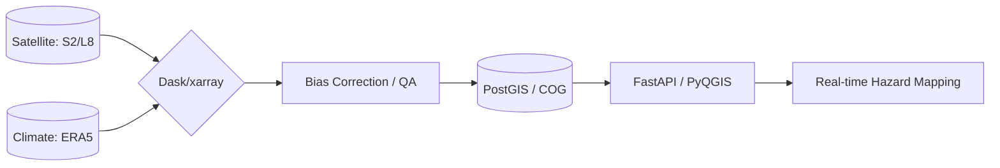

# Badre Abderrahmane Alloul
**Geospatial Software Engineer & Computational Hydrologist**  
*Building scalable environmental intelligence systems | Lyon, France*

---

### 🏗️ Geospatial Systems Architecture
I design data engines that transform raw planetary observations into decision-ready insights. My focus is on **Engineering over Drafting**—deploying automated, high-performance pipelines instead of manual 2D CAD workflows.

---

### 🎯 Domain Expertise Distribution
*Quantifying the impact areas of my engineering workflows.*

| Domain | Proficiency | Core Focus |
| :--- | :--- | :--- |
| **Computational Hydrology** | `████████░░ 80%` | Wflow-SBM, HEC-HMS, TELEMAC-2D, Statistical/Extreme value analysis. |
| **Energy & Infrastructure** | `██████░░░░ 60%` | Hydropower optimization, OnSSET least-cost planning, cascade modeling. |
| **Geospatial AI & RS** | `██████░░░░ 60%` | TorchGeo segmentation, spectral indices (NDVI/NBR), multi-TB pipelines. |
| **Software & Cloud Ops** | `████░░░░░░ 40%` | Docker/Singularity, SLURM HPC, FastAPI, Pydantic validation. |

---

### 🔬 Technical Rigor & Selected Outcomes
- **National Flood Analytics (INRAe 2025)**: Modularized research prototypes into production Python packages. Scaled processing from days to hours using chunked Dask workloads on SLURM clusters.
- **Serverless Flood Data Lake (REOR20)**: Architected an S3-native infrastructure using **STAC** and **Cloud Optimized Geotiffs (COG)** to serve sub-second hazard queries via FastAPI.
- **4GW Hydropower Portfolio (ENGIE)**: Engineered operational forecasting systems integrating SCADA/ERA5 data. Developed dam-release optimizers using Bayesian tuning and Numba JIT for 80% compute reduction.
- **Spatio-Temporal Optimization**: Led the design of a national PostGIS schema for **150+ dams**, delivering low-latency spatial indexing (GiST) for multi-user GIS environments.

---

### 🔧 The Architect's Stack
- **Languages**: Python (NumPy, SciPy, xarray, Dask), SQL, Bash, Lua.
- **Geospatial**: Rasterio, GDAL/OGR, GeoPandas, Shapely, PyQGIS (PyQt), Google Earth Engine.
- **Simulation**: TELEMAC-2D, ANUGA, HEC-RAS, HEC-HMS, Wflow-SBM.
- **Infrastructure**: SLURM (500+ job orchestration), Docker, AWS (S3/Lambda/EC2), CI/CD.

---

### 🚀 Motivation: Scaling Environmental Intelligence
I bridge the gap between scientific modeling and scalable production. My commitment is to **observable, reproducible, and verifiable engineering**.

[**Deep-dive into my work →**](https://badibosspy.github.io) • [**Connectivity →**](https://linkedin.com/in/badre-abderrahmane-alloul)

> *"Precision at scale is an engineering problem, not a drafting task."*

