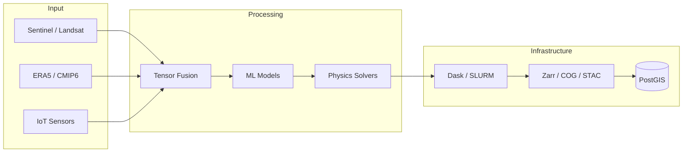

### Badre Abderrahmane Alloul
**Geospatial Solutions Architect | Environmental Data Scientist**
*Lyon, France*

---

I build **production-grade geospatial systems** that connect Earth Observation data to physical simulation and machine learning. I write the code, design the architecture, and understand the science underneath. 

**What makes me different:** I operate across the full stack—from deriving algorithms grounded in radiative transfer physics, to deploying distributed pipelines on HPC and cloud infrastructure, to optimizing spatial database queries.  Most people specialize in one layer.  I integrate all of them.

---

### System Design

---

### Core Competencies

| Layer | What I Build |
| : --- | :--- |
| **Domain Science** | Hydrology, flood modeling, water resource optimization.  I understand the governing equations before writing code. |
| **Geospatial Engineering** | GDAL, Rasterio, GeoPandas, PostGIS.  Efficient I/O on TB-scale raster and vector datasets.  Spatial indexing, projection handling, format conversion. |
| **Simulation** | TELEMAC-2D, Wflow, HEC-RAS.  Automating model setup, calibration, and result extraction through Python wrappers. |
| **Machine Learning** | PyTorch, TorchGeo.  Semantic segmentation on multispectral imagery.  Physics-informed neural networks for hybrid modeling. |
| **Data Infrastructure** | xarray, Dask, Zarr, BigQuery.  Lazy computation on massive climate archives. Cloud-native formats and catalogs (COG, STAC). |
| **Platform & DevOps** | Docker, Singularity, SLURM, AWS/GCP.  Reproducible environments from laptop to HPC cluster to serverless cloud. |

---

### Selected Work

- **Automated flood forecasting pipeline** — Ingests NWP forecasts, runs hydrodynamic simulation, publishes vector tile alerts.  End-to-end latency under 15 minutes. 
- **Satellite-based water detection at scale** — CNN trained on Sentinel-1 SAR to map surface water through cloud cover. Deployed on multi-country AOIs.
- **Differentiable hydrological calibration** — Replaced manual parameter tuning with gradient-based optimization.  Reduced calibration time from weeks to hours.
- **Climate data platform architecture** — Designed ETL pipelines processing CMIP6/ERA5 archives into analysis-ready Zarr stores for downstream modeling teams.

---

### What I Am Looking For

Roles where **geospatial depth meets software engineering rigor**:  Solutions Architect, Staff Engineer, Principal Data Scientist, or Technical Lead in climate tech, Earth observation, water, energy, or environmental risk. 

I want to build systems that matter—infrastructure that turns planetary-scale data into decisions. 

---

Reproducibility is mandatory. Containers, version control, documented provenance.  If it cannot be re-run from scratch, it is not engineering.

[**→ Full Portfolio**](https://badibosspy. github.io)
