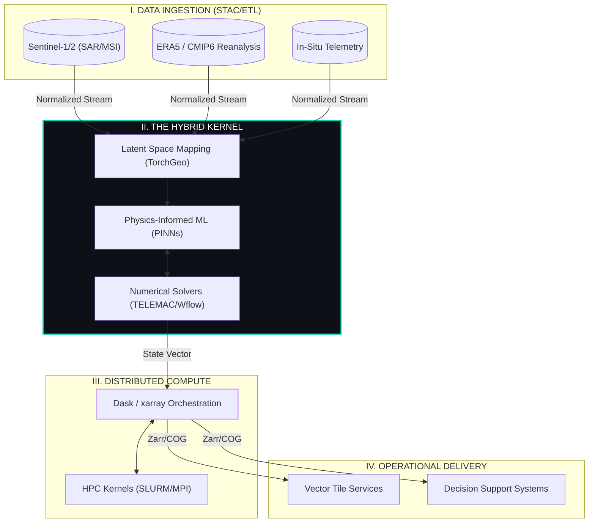

### Badre Abderrahmane Alloul
**Geospatial Solutions Architect | Computational Hydrologist**
*Lyon, France*

---

### 🌐 The Computational Synthesis

I engineer **production-grade environmental systems**. My work bridges the gap between **Physical Simulation** (PDE solvers) and **Artificial Intelligence** (Stochastic inference).

Most environmental workflows are static and fragmented. I build **persistent, auto-calibrating digital twins**. I design architectures where satellite telemetry forces hydrological models in real-time, scaled via HPC and Cloud infrastructure. I do not just run models; I architect the pipelines that make them operational, reproducible, and scalable.

---

### 📐 System Topology: The Hybrid Architecture

My core architectural pattern integrates deterministic physics with data-driven ML. This topology handles the velocity of Earth Observation data without compromising physical consistency.

---

### 🔬 Engineering Focus

I operate at the intersection of **Physics, Code, and Infrastructure**:

1.  **Hybrid Modeling (Physics + AI):** Moving beyond black-box ML. I embed physical constraints (mass conservation, momentum) into neural networks to create robust predictors for data-scarce environments.
2.  **HPC & Cloud Scalability:** Designing "compute-agnostic" pipelines that run seamlessly on on-premise SLURM clusters or AWS Fargate. I optimize for I/O bottlenecks using lazy loading (Dask) and cloud-native formats (Zarr/COG).
3.  **Automated Calibration:** Replacing manual parameter tuning with differentiable programming. Using gradient-based optimization to auto-calibrate hydrological parameters (Manning’s *n*, conductivity) against real-time observation.

---

### 🔧 Technological Arsenal

#### 🌍 Geospatial Core
*The foundational layer for spatial manipulation.*

#### 🌊 Simulation & Physics
*Deterministic solvers for fluid dynamics and hydrology.*

#### 🤖 Intelligence & Compute
*Stochastic modeling and distributed processing.*

#### ☁️ Infrastructure & DevOps
*Reproducibility and deployment.*

---

### 🎨 Philosophy

> *"Code is the modern notation for physical law."*

I advocate for **Open Science** as a strict engineering requirement. Environmental models must be version-controlled, containerized, and documented to withstand scrutiny. If it cannot be re-run from scratch by a third party, it is not science—it is an anecdote.

[**Explore Architecture Portfolio →**](https://badibosspy.github.io)
