# Badre Abderrahmane Alloul
**Geospatial Software Engineer & Computational Hydrologist**  
*Building technical systems for water, energy, and agricultural sectors.*

---

### 🌐 Professional Focus
I design and deploy software systems that solve physical-world problems. My background in **Hydroinformatics** and **Numerical Simulation** allows me to bridge the gap between scientific modeling and production-grade software engineering. I focus on building reliable workflows for large-scale environmental data analysis.

---

### ⚙️ Engineering Workflow
*A simplified view of how I move from raw data to operational systems.*

```mermaid
graph LR
    A[Data Acquisition] --> B[Processing & Modeling]
    B --> C[Infrastructure & Storage]
    C --> D[Operational Deployment]

    subgraph "Details"
        A --- A1[Satellite / Climate / Sensors]
        B --- B1[Numerical Models / Deep Learning]
        C --- C1[PostGIS / Cloud Native / HPC]
        D --- D1[APIs / Decision Tools]
    end

    style A fill:#0c0c0f,stroke:#00d4aa,stroke-width:1px;
    style B fill:#0c0c0f,stroke:#00d4aa,stroke-width:1px;
    style C fill:#0c0c0f,stroke:#00d4aa,stroke-width:1px;
    style D fill:#0c0c0f,stroke:#00d4aa,stroke-width:1px;
```

---

### �️ Toolbox & Skills

#### Geospatial & Remote Sensing
- **Libraries**: `GDAL/OGR`, `Rasterio`, `GeoPandas`, `Fiona`, `Shapely`.
- **Platforms**: `QGIS (PyQGIS)`, `Google Earth Engine`, `STAC/COG`.
- **Analysis**: Spectral indices, change detection, and spatial optimization.

#### Simulation & Domain Modeling
- **Hydrology/Hydraulics**: `Wflow-SBM`, `TELEMAC-2D`, `ANUGA`, `HEC-HMS`, `HEC-RAS`.
- **Infrastructure**: Least-cost energy planning, hydropower optimization, and dam safety.
- **Statistics**: Extreme value analysis and bias correction methods.

#### Software & Cloud Engineering
- **Languages**: `Python` (NumPy, SciPy, xarray, Dask), `SQL`, `Bash`.
- **DevOps**: `Docker`, `SLURM (HPC)`, `Git / GitHub Actions`, `Linux`.
- **Cloud**: `AWS (S3, Lambda)`, `BigQuery`, Serverless geospatial architectures.

#### Recent Technical Interests
- Developing **Deep Learning** pipelines for satellite imagery segmentation (TorchGeo).
- Scaling **Cloud-Native** geospatial data lakes for low-latency queries.
- Optimizing distributed computing for multi-terabyte environmental datasets.

---

### 📐 Engineering Approach
I prioritize **reproducibility** and **scalability**. Whether I am modeling a river basin or architecting a data pipeline, my goal is to create systems that are accurate, maintainable, and efficient.

[**Full Portfolio →**](https://badibosspy.github.io) • [**Connectivity →**](https://linkedin.com/in/badre-abderrahmane-alloul)

> *"The quality of a model is defined by its utility and the reliability of the system that serves it."*
