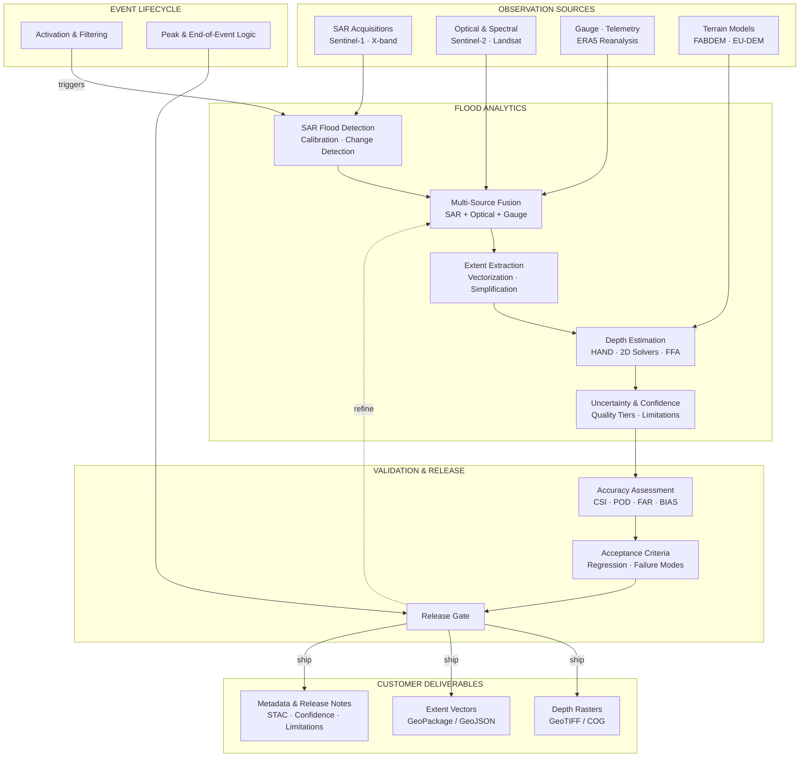

### Badre Abderrahmane Alloul

**Senior Geospatial Analytics Engineer — Flood Observation, Depth Estimation & Hazard Delivery**

Lyon, France

---

I build production flood analytics. I turn SAR satellite observations, terrain data, and hydrological models into flood extent and depth outputs — tested, validated, and shipped under operational time pressure.

6 years doing this across catastrophe risk (Lloyd's of London, Munich Re via REOR20 AG), national research (INRAe, ENGIE/CNR), and dam infrastructure (ANBT — National Dams Agency). Co-developed SAR flood mapping pipelines with Google and ESA for near-real-time disaster response. Validated modelled flood outputs against ICEYE SAR observations on real European events — Rhine-Moselle, Thessaly, Emilia-Romagna, Pas-de-Calais.

End-to-end: from event detection and multi-source data fusion, through depth estimation and uncertainty quantification, to GeoTIFF/GeoPackage deliverables with documented confidence and known limitations.

---

### Flood Analytics System Architecture

This is the system I build and operate — from event trigger to validated deliverable.

```mermaid
flowchart TD
    subgraph EVENT ["EVENT LIFECYCLE"]
        ACT["Activation & Filtering"]
        PEAK["Peak & End-of-Event Logic"]
    end

    subgraph OBS ["OBSERVATION SOURCES"]
        SAR["SAR Acquisitions<br>Sentinel-1 · X-band"]
        OPT["Optical & Spectral<br>Sentinel-2 · Landsat"]
        AUX["Gauge · Telemetry<br>ERA5 Reanalysis"]
        DEM["Terrain Models<br>FABDEM · EU-DEM"]
    end

    subgraph CORE ["FLOOD ANALYTICS"]
        DET["SAR Flood Detection<br>Calibration · Change Detection"]
        FUSE["Multi-Source Fusion<br>SAR + Optical + Gauge"]
        EXT["Extent Extraction<br>Vectorization · Simplification"]
        DEP["Depth Estimation<br>HAND · 2D Solvers · FFA"]
        UQ["Uncertainty & Confidence<br>Quality Tiers · Limitations"]
    end

    subgraph QA ["VALIDATION & RELEASE"]
        MET["Accuracy Assessment<br>CSI · POD · FAR · BIAS"]
        ACC["Acceptance Criteria<br>Regression · Failure Modes"]
        REL["Release Gate"]
    end

    subgraph SHIP ["CUSTOMER DELIVERABLES"]
        R1["Depth Rasters<br>GeoTIFF / COG"]
        R2["Extent Vectors<br>GeoPackage / GeoJSON"]
        R3["Metadata & Release Notes<br>STAC · Confidence · Limitations"]
    end

    ACT -->|triggers| DET
    SAR --> DET
    DET --> FUSE
    OPT --> FUSE
    AUX --> FUSE
    FUSE --> EXT --> DEP
    DEM --> DEP
    DEP --> UQ
    UQ --> MET --> ACC --> REL
    PEAK --> REL
    REL -->|ship| R1 & R2 & R3
    REL -.->|refine| FUSE
```

---

### What I Ship

#### SAR Flood Detection & Multi-Source Fusion

Automated flood extent extraction from SAR imagery (Sentinel-1, X-band): calibration to sigma-nought, speckle filtering, Otsu thresholding, change detection against pre-event baselines. Fuse SAR with optical (Sentinel-2 NDVI/NDWI), gauge telemetry, and ERA5 reanalysis to produce consistent extent outputs in cloud cover, darkness, and mixed conditions. Shipped at REOR20 AG for Google/ESA disaster response; at INRAe for 10 m flood damage classification across field campaigns.

#### Depth Estimation & Return-Period Mapping

HAND-based depth computation validated against USGS 3DEP. 2D hydraulic simulation with TELEMAC-2D and Anuga (shallow-water solvers, unstructured meshes, Manning parameterization). Flood frequency analysis (GEV, Gumbel, L-moments) for T10–T500 return-period inundation maps forced with ERA5 and E-OBS precipitation. Depth validated at gauge locations: Koblenz Rhine gauge residual within 5.9% of observed stage.

#### Validation & Acceptance Criteria

Pixel-level accuracy assessment — CSI, POD, FAR, BIAS — comparing modelled extents to SAR-observed inundation across multiple events. Spatial error decomposition by land cover and terrain type (urban fringe double-bounce, tributary under-detection, flat terrain over-prediction). Documented failure modes, known limitations, and explicit acceptance criteria for each output. Performed at REOR20 AG against ICEYE SAR observations: Rhine-Moselle, Thessaly, Emilia-Romagna, Pas-de-Calais.

#### Production Geospatial Delivery

GeoTIFF/COG depth rasters. GeoPackage/GeoJSON extent vectors. STAC catalogs and ISO 19115 metadata. CF-compliant NetCDF and Zarr for climate data. PostGIS backends with GiST indexing (10M+ features, sub-second queries). WMS/WFS endpoints via FastAPI. Dask/xarray pipelines for TB-scale processing. Docker, CI/CD, SLURM HPC (500+ parallel jobs). Everything tested with pytest, validated with Pydantic.

---

### How I Work

- **Ship in small increments.** Finish over start. Limit work in progress.
- **Own what I ship.** Observable systems, clear runbooks, calm operations — not heroics.
- **Make trade-offs explicit.** Document what "good enough" means and why. Known limitations are part of the output.
- **Raise the system.** Turn recurring pain into defaults others adopt: test datasets, validation tools, pipelines, analysis templates.

---

### Technical Stack

| Domain | Capabilities |
|---|---|
| **Flood & Hydrology** | Flood extent/depth mapping · Flood frequency analysis (GEV, Gumbel, L-moments) · Return-period mapping (T10–T500) · HAND computation · SCS-CN runoff · HEC-HMS · TELEMAC-2D · Wflow-SBM · DEM conditioning · Watershed delineation |
| **SAR & Remote Sensing** | Sentinel-1 SAR flood detection · Sentinel-2 optical classification · Spectral indices (NDVI, NDWI, NBR) · Multi-source data fusion (SAR + optical + gauge) · Google Earth Engine |
| **Python (Production)** | OOP library design · pytest · Pydantic validation · FastAPI · Numba JIT · Structured logging · Failure handling · Reproducible evaluation (confusion matrices, precision/recall/F1, calibration curves) |
| **Geospatial Formats** | GeoTIFF / COG · GeoPackage · GeoJSON · GeoParquet · CF-NetCDF · Zarr · STAC catalogs · OGC WMS/WFS · ISO 19115 metadata |
| **Data Processing** | GDAL/OGR · GeoPandas · Shapely · Rasterio · Fiona · pyproj · xarray · Dask · CDO/NCO (bias correction, regridding) · Raster/vector ETL at TB scale |
| **Infrastructure** | PostgreSQL/PostGIS (GiST indexing, query optimization) · Docker · CI/CD (GitLab CI, GitHub Actions) · SLURM HPC · AWS / Azure · Apache Airflow |

---

### Background

**MSc Numerical Modeling & Hydraulic Engineering** — Grenoble INP–ENSE3, 2021
Thesis: calibration and uncertainty quantification of hydraulic models using surrogate methods (Kriging, polynomial chaos). Coursework: HPC & numerical simulation, atmospheric science, statistical modeling.

**MEng Hydraulic Structures & Water Engineering** — ENSH, Algiers, 2019
Valedictorian. French Government Excellence Scholarship. Coursework: GIS & spatial analysis, stochastic hydrology, database design.

**Classes Preparatoires (CPGE)** — Ecole Polytechnique d'Algerie, 2016
Ranked 2nd / 900 at the National Entrance Exam. Mathematics & Physics.

**Languages:** English (C2) · French (native) · Arabic (native)

---

[**Explore Full Architecture Portfolio →**](https://badibosspy.github.io)
