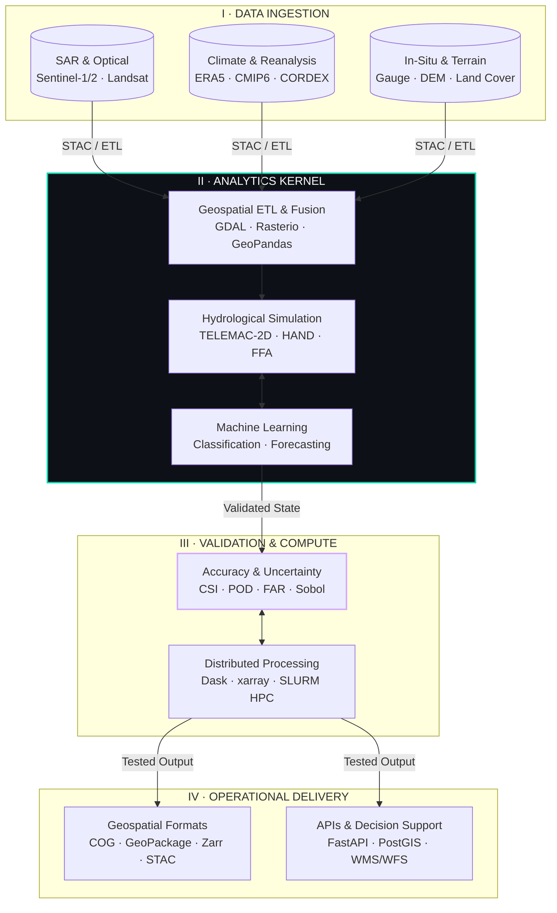

### Badre Abderrahmane Alloul
**Geospatial Analytics Engineer | Computational Hydrologist**
*Lyon, France*

---

I build production geospatial systems for flood, climate, and environmental analytics. I take satellite observations, hydrological models, and terrain data from research prototype to tested, operational output — shipped under time pressure, documented for third-party scrutiny.

6 years across catastrophe risk (Lloyd's of London, Munich Re via REOR20 AG), national research (INRAe, ENGIE/CNR), energy infrastructure (4 GW hydropower, 19-dam cascade), and water resource planning (ANBT — National Dams Agency). Co-developed SAR flood mapping pipelines with Google and ESA. Shipped flood analytics, climate risk models, electrification tools, and hazard platforms across Europe, North Africa, the Middle East, and West Africa (World Bank/ESMAP).

End-to-end: from satellite data ingestion and multi-source fusion, through hydrological simulation and machine learning, to validated geospatial deliverables — GeoTIFF/COG, GeoPackage, STAC catalogs, PostGIS APIs, and decision dashboards.

---

### System Architecture

Core pattern: integrate earth observation data with physics-based simulation and data-driven ML, validate rigorously, deliver through cloud-native formats and APIs.

```mermaid
flowchart TD
    subgraph L1 ["I · DATA INGESTION"]
        A1[("SAR & Optical<br>Sentinel-1/2 · Landsat")]
        A2[("Climate & Reanalysis<br>ERA5 · CMIP6 · CORDEX")]
        A3[("In-Situ & Terrain<br>Gauge · DEM · Land Cover")]
    end

    subgraph L2 ["II · ANALYTICS KERNEL"]
        direction LR
        B1["Geospatial ETL & Fusion<br>GDAL · Rasterio · GeoPandas"]
        B2["Hydrological Simulation<br>TELEMAC-2D · HAND · FFA"]
        B3["Machine Learning<br>Classification · Forecasting"]
        B1 --> B2
        B2 <--> B3
    end

    subgraph L3 ["III · VALIDATION & COMPUTE"]
        C1["Accuracy & Uncertainty<br>CSI · POD · FAR · Sobol"]
        C2["Distributed Processing<br>Dask · xarray · SLURM HPC"]
    end

    subgraph L4 ["IV · OPERATIONAL DELIVERY"]
        D1["Geospatial Formats<br>COG · GeoPackage · Zarr · STAC"]
        D2["APIs & Decision Support<br>FastAPI · PostGIS · WMS/WFS"]
    end

    A1 & A2 & A3 -->|STAC / ETL| B1
    B3 -->|Validated State| C1
    C1 <--> C2
    C2 -->|Tested Output| D1 & D2

    style L2 fill:#0d1117,stroke:#00d4aa,stroke-width:2px,color:#fff
    style C1 stroke:#d2a8ff,stroke-width:2px
```

---

### What I Build

#### Flood & Hazard Analytics

SAR-based flood extent extraction (Sentinel-1, X-band): calibration, speckle filtering, change detection against pre-event baselines. Multi-source fusion (SAR + optical + gauge) for consistent extent outputs under cloud cover and darkness. Flood depth estimation via HAND and 2D hydraulic solvers (TELEMAC-2D, Anuga). Return-period inundation mapping (T10–T500) from GEV/L-moment flood frequency analysis. Flood damage classification from Sentinel-2 spectral indices at 10 m resolution. Pixel-level validation (CSI, POD, FAR) against SAR observations on real flood events. Documented failure modes and acceptance criteria for each output tier.

#### Climate Data Engineering

Multi-TB climate data processing (ERA5, CMIP6, CORDEX) with CDO/NCO, xarray, and Dask on SLURM HPC clusters. Bias correction (quantile mapping), regridding, statistical downscaling — CF-compliant NetCDF and Zarr outputs. Climate projection analysis (SSP2-4.5, SSP5-8.5) for infrastructure risk and adaptation planning. Automated ingestion from Copernicus, Theia, and IGN APIs via STAC catalogs. Served climate risk layers to institutional clients through FastAPI/PostGIS endpoints.

#### Production Geospatial Software

Python libraries with OOP architecture, pytest coverage, and Pydantic validation. QGIS plugins (PyQGIS) deployed to 15+ field users with bilingual documentation and training. FastAPI services backed by PostGIS with GiST indexing — sub-second spatial queries on 10M+ features. Cloud-native deliverables: COG, GeoPackage, GeoParquet, Zarr, STAC metadata, ISO 19115. Docker containerization, CI/CD (GitLab CI, GitHub Actions), SLURM HPC orchestration (500+ parallel jobs). First published Docker image for TELEMAC-2D/Gmsh.

#### Energy & Infrastructure Analytics

Hydropower inflow forecasting (XGBoost-LSTM, 1–90 day horizons) for a 19-dam cascade, 4 GW portfolio. Walk-forward temporal validation with MAE/RMSE decomposition by season and catchment. CMIP6 climate impact assessment on hydropower production across multiple river basins. Least-cost electrification modeling (OnSSET) for 50+ off-grid communities in Benin (World Bank/ESMAP) — PV, mini-grid, and hybrid scenarios with LCOE optimization. Renewable site suitability analysis across 5,000+ candidates using multi-criteria spatial analysis. Stakeholder dashboards (Power BI, Leaflet) connected to PostGIS for operational decision-support.

---

### How I Work

- **Ship tested code, not notebooks.** Libraries, APIs, containerized pipelines — reproducible from scratch by a third party.
- **Own what I ship.** Observable systems, clear documentation, calm operations.
- **State limitations explicitly.** Every output documents what it covers and what it does not.
- **Turn recurring work into reusable tools.** Libraries, plugins, pipelines, templates that others adopt.

---

### Technical Stack

| Domain | Capabilities |
|---|---|
| **Flood & Hydrology** | Flood extent/depth mapping · Flood frequency analysis (GEV, L-moments) · Return-period mapping (T10–T500) · HAND · SCS-CN · TELEMAC-2D · Wflow-SBM · HEC-RAS · DEM conditioning · Watershed delineation |
| **SAR & Remote Sensing** | Sentinel-1 SAR flood detection · Sentinel-2 optical classification · Spectral indices (NDVI, NDWI, NBR) · Multi-source data fusion · Google Earth Engine |
| **Climate Data** | ERA5 · CMIP6/CORDEX · CDO/NCO (bias correction, regridding) · CF-NetCDF · Zarr · Statistical downscaling · Quantile mapping |
| **ML & Forecasting** | scikit-learn · XGBoost · PyTorch / TorchGeo · LSTM · Gaussian Process · U-Net segmentation · OnSSET · LCOE optimization |
| **Python (Production)** | OOP library design · pytest · Pydantic · FastAPI · Numba · PyQGIS plugin dev · Structured logging · Failure handling |
| **Geospatial Formats** | GeoTIFF / COG · GeoPackage · GeoJSON · GeoParquet · CF-NetCDF · Zarr · STAC catalogs · OGC WMS/WFS · ISO 19115 |
| **Data Processing** | GDAL/OGR · GeoPandas · Shapely · Rasterio · Fiona · pyproj · xarray · Dask · CDO/NCO · TB-scale raster/vector ETL |
| **Infrastructure** | PostgreSQL/PostGIS (GiST indexing) · Docker · CI/CD (GitLab CI, GitHub Actions) · SLURM HPC · AWS / Azure · Apache Airflow |

---

### Background

**MSc Numerical Modeling & Hydraulic Engineering** — Grenoble INP–ENSE3, 2021
Thesis: calibration and uncertainty quantification of hydraulic models using surrogate methods (Kriging, polynomial chaos). Coursework: HPC & numerical simulation, atmospheric science, statistical modeling.

**MEng Hydraulic Structures & Water Engineering** — ENSH, Algiers, 2019
Valedictorian. French Government Excellence Scholarship. Coursework: GIS & spatial analysis, stochastic hydrology, database design.

**Classes Préparatoires (CPGE)** — École Polytechnique d'Algérie, 2016
Ranked 2nd / 900 at the National Entrance Exam. Mathematics & Physics.

**Languages:** English (C2) · French (native) · Arabic (native)

---

[**Explore Full Architecture Portfolio →**](https://badibosspy.github.io)
