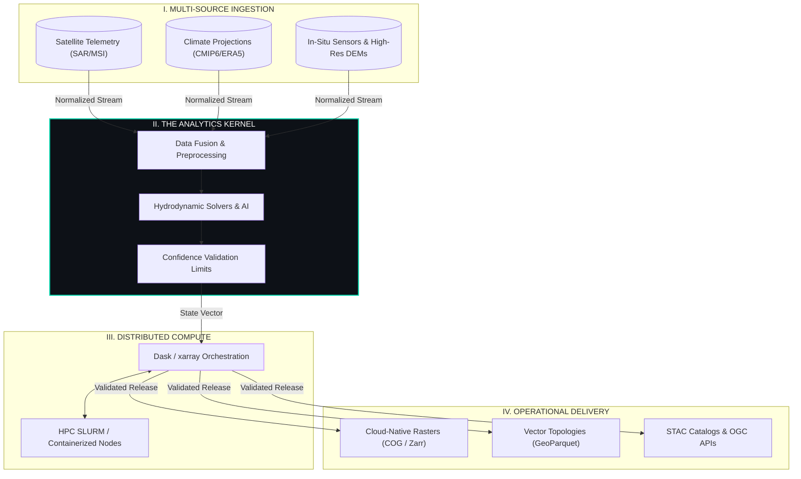

### Badre Abderrahmane Alloul
**Senior Geospatial Analytics Engineer | Computational Hydrologist**
*Lyon, France*

[](https://badibosspy.github.io)
[](https://linkedin.com/in/badre-abderrahmane-alloul)
[](mailto:badrallouldjazairi@gmail.com)

---

### 🌐 The Computational Synthesis

I engineer **production-grade environmental systems**. My work bridges the critical gap between **Physical Simulation** (Hydrodynamics & PDE solvers) and **Scalable Software Engineering** (Cloud-native pipelines, Distributed compute, Automation).

Most environmental workflows are static, fragmented, or confined to local research environments. I build **persistent, automated analytics pipelines** that process high-velocity Earth Observation data (SAR, Multispectral, Climate Reanalysis) into deterministic outputs. I do not just run models; I architect the highly reliable, tested infrastructures that make complex geospatial data actionable, reproducible, and scalable.

---

### 📐 System Topology: The Hybrid Architecture

My core architectural pattern integrates complex multi-source data with physical models, optimized for both High-Performance Computing (HPC) and Cloud-Native environments.


```mermaid
flowchart TD
    subgraph L1 ["I. MULTI-SOURCE INGESTION"]
        A1[("Satellite Telemetry (SAR/MSI)")]
        A2[("Climate Projections (CMIP6/ERA5)")]
        A3[("In-Situ Sensors & High-Res DEMs")]
    end

    subgraph L2 ["II. THE ANALYTICS KERNEL"]
        direction LR
        B1["Data Fusion & Preprocessing"]
        B2["Hydrodynamic Solvers & AI"]
        B3["Confidence Validation Limits"]
        B1 --> B2 --> B3
    end

    subgraph L3 ["III. DISTRIBUTED COMPUTE"]
        C1["Dask / xarray Orchestration"]
        C2["HPC SLURM / Containerized Nodes"]
    end

    subgraph L4 ["IV. OPERATIONAL DELIVERY"]
        D1["Cloud-Native Rasters (COG / Zarr)"]
        D2["Vector Topologies (GeoParquet)"]
        D3["STAC Catalogs & OGC APIs"]
    end

    A1 & A2 & A3 -->|Normalized Stream| B1
    B3 -->|State Vector| C1
    C1 <--> C2
    C1 -->|Validated Release| D1 & D2 & D3

    style L2 fill:#0d1117,stroke:#00d4aa,stroke-width:2px,color:#fff
    style C1 stroke:#d2a8ff,stroke-width:2px
```

---

### 🔬 Core Engineering Pillars

I operate exclusively at the intersection of **Domain Expertise, Code, and Infrastructure**:

1. **Production-Grade Analytics:** Moving away from ad-hoc scripts. I design Object-Oriented (OOP) Python libraries and automated Extract-Transform-Load (ETL) pipelines backed by strict spatial QA/QC, unit testing (`pytest`), and continuous integration.
2. **Cloud-Native Geospatial Infrastructure:** Managing multi-terabyte datasets using modern standards. I convert raw vector/raster data into Cloud-Optimized GeoTIFFs (COG), GeoParquet, and Zarr formats, cataloged via STAC to drastically reduce I/O bottlenecks.
3. **Calm Operations & Validation:** Building observable systems. I implement automated regression checks, explicit acceptance criteria, and well-documented operational runbooks to ensure that complex hazard deliverables ship reliably under time pressure.
4. **Physical & Algorithmic Rigor:** Deep theoretical backing in fluid mechanics and stochastic hydrology. Whether automating TELEMAC-2D/ANUGA on a SLURM cluster or extracting flood extents from SAR imagery, the output remains physically consistent and statistically sound.

---

### 🔧 Technological Arsenal

#### 🌍 Geospatial Core & Data Engineering


#### 🌊 Simulation, Physics & Climate


#### 🤖 Intelligence & Scale


#### ☁️ Infrastructure & DevOps


---

### 🚀 Selected Impact & Track Record

* **Global Catastrophe Risk Platform (REOR20):** Engineered automated HPC workflows processing 10+ TB/month of CORDEX/CMIP6 archives. Built automated ETL pipelines converting mass vector/raster datasets into COG and GeoParquet with STAC metadata for institutional clients (Lloyd's, Munich Re).
* **Automated Flood Classification (INRAe):** Architected an open-source OOP Python library and custom MVC-pattern PyQGIS plugin for flood risk mapping. Automated the ingestion of Copernicus APIs to classify damage probability from Sentinel-2 imagery using Gaussian Processes.
* **Energy Systems & Sub-Seasonal Forecasting (ENGIE):** Developed XGBoost-LSTM pipelines for hydrological forecasting. Quantified long-term CMIP6 precipitation impacts on hydropower infrastructure. Co-developed the first Docker image for TELEMAC-2D/Gmsh to standardize modeling environments.
* **National Geospatial Infrastructure (ANBT):** Designed sub-500ms PostgreSQL/PostGIS databases with GiST indexing for national water-resource planning. Built automated ArcGIS (ArcPy) toolchains for rapid DEM conditioning and HEC-RAS 2D model generation.

---

### 🎨 Philosophy

> *"Code is the modern notation for physical law."*

I advocate for **Open Science** and **Operational Reliability** as strict engineering requirements. Environmental models must be version-controlled, containerized, and rigorously validated to withstand scrutiny. I prioritize flow over ceremony, favoring paved paths, CI/CD guardrails, and automated validation to turn recurring analytical pain into scalable solutions.

[**Explore Architecture Portfolio →**](https://badibosspy.github.io)
```
